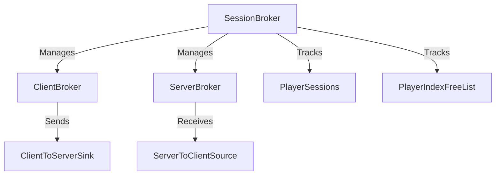

# Longboy Server CLI Architecture

## Broker Module Overview

This diagram illustrates how the broker module manages client connections, routes messages through a queue system, and maintains client state through a registry.
